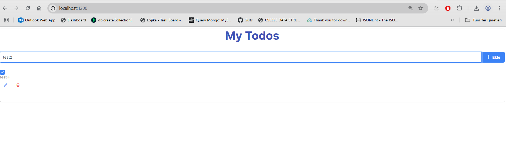
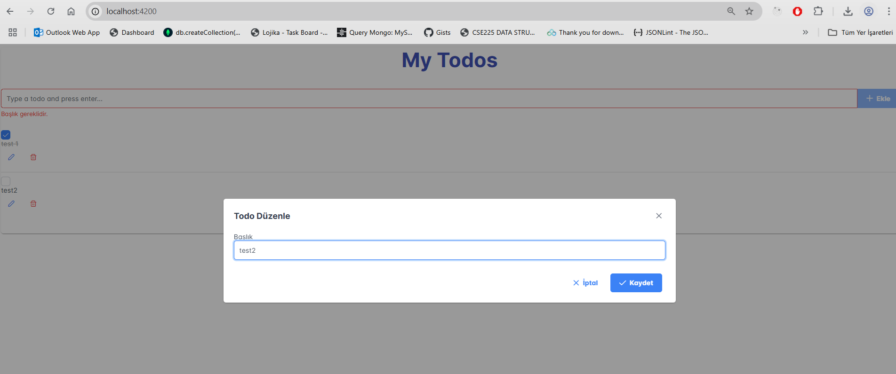

# Todo Uygulaması (Spring Boot & Angular)

Bu proje, Spring Boot ile geliştirilmiş bir RESTful API backend'i ve Angular ile oluşturulmuş bir frontend'i içeren basit bir Todo List uygulamasıdır. Kullanıcılar todo ekleyebilir, listeleyebilir, güncelleyebilir ve silebilirler.

---

## Proje Yapısı

Proje iki ana dizine ayrılmıştır:

* `main/`: Spring Boot RESTful API'sini içerir.
* `frontend-new/`: Angular kullanıcı arayüzünü içerir.

## Gereksinimler

Her iki bölümü de çalıştırmak için aşağıdaki yazılımların sisteminizde yüklü olması gerekmektedir:

* **Java 17 veya üzeri** (Backend için)
* **Maven 3.6.x veya üzeri** (Backend için)
* **Node.js 18.x veya üzeri** (Frontend için)
* **Angular CLI 18.x veya üzeri** (Frontend için)

## Kurulum ve Çalıştırma

Proje iki şekilde çalıştırılabilir:

### Doğrudan Çalıştırma

#### Backend (Spring Boot)

1.  Terminali açın ve `main` dizinine gidin:
    ```bash
    cd main
    ```
2.  Maven kullanarak projeyi derleyin (build):
    ```bash
    mvn clean install
    ```
    Bu komut `target` dizini altında bir `.jar` dosyası oluşturacaktır.
3.  Uygulamayı çalıştırın:
    ```bash
    java -jar target/todo-0.0.1-SNAPSHOT.jar
    ```
    veya Spring Boot Maven eklentisi ile:
    ```bash
    mvn spring-boot:run
    ```
    Backend varsayılan olarak `http://localhost:8080` adresinde çalışacaktır. SQLite veritabanı (`todos.db`) otomatik olarak `data/` dizininde oluşturulacaktır.

#### Frontend (Angular)

1.  Yeni bir terminal açın ve `frontend-new` dizinine gidin:
    ```bash
    cd frontend-new
    ```
2.  Node.js bağımlılıklarını yükleyin:
    ```bash
    npm install
    ```
3.  Angular uygulamasını başlatın:
    ```bash
    ng serve --open
    ```
    Bu komut uygulamayı derleyecek ve varsayılan olarak `http://localhost:4200` adresinde tarayıcınızda açacaktır.

### Docker ile Çalıştırma

Docker ile çalıştırmak, uygulamayı bağımsız ve taşınabilir kapsayıcılarda çalıştırmanızı sağlar.

#### Docker Kurulumu

Sisteminizde [Docker Desktop](https://www.docker.com/products/docker-desktop/) kurulu olduğundan emin olun.

#### Docker Compose ile Çalıştırma

1.  Projenin ana dizinine gelin (yani `main` ve `frontend-new` klasörlerinin bulunduğu dizine).
2.  Aşağıdaki komutu çalıştırın:
    ```bash
    docker-compose up --build -d
    ```
    Bu komut Docker imajlarını derleyecek ve servisleri arka planda başlatacaktır (`-d`).
3.  Uygulamalar çalışmaya başladığında, tarayıcınızdan `http://localhost:4200` adresine erişebilirsiniz.

Servisleri durdurmak için:
```bash
docker-compose down
```

## API Dokümantasyonu

Backend uygulaması çalışırken, Swagger UI aracılığıyla API dokümantasyonuna erişebilirsiniz:

* **Swagger UI:** `http://localhost:8080/swagger-ui.html`

## Kullanım

Uygulama açıldığında:

* Metin kutusuna bir todo yazın ve Enter tuşuna basın veya "Add Todo" butonuna tıklayın. Liste eklenir.
* Listede yer alan bir todo'yu tamamlandı olarak işaretlemek için yanındaki kutuya tıklayın.
* Listede yer alan bir todo'yu düzenlemek için ilgili todo kaydına tıklayın ve title alanını güncelleyip enter butonuna basın.
* Bir todo'yu silmek için yanındaki delete butonuna tıklayın.

## Ek Bilgiler

* **Veritabanı:** Uygulama, geliştirme ortamında SQLite ve MongoDb kullanır. SQLite veritabanı dosyası `data/todos.db` konumunda bulunur. MongoDb kurulumu yapılıp `application.properties` dosyasında yer alan konfigürasyonlar yapılır.
* **Docker Çalışmasının Takibi:** Docker çalışmasının takibi ve bazı ekran görüntüleri de projede mevcuttur. MongoDb ayrı makine gibi SqlLite ise backend ile birlikte aynı makinededir.
* **CORS Politikası:** Backend, Angular uygulamasının varsayılan adresi olan `http://localhost:4200` adresinden gelen isteklere izin verecek şekilde yapılandırılmıştır.
* **Hata Ayıklama:** Geliştirme sırasında herhangi bir sorunla karşılaşırsanız, backend ve frontend konsol çıktılarını dikkatlice inceleyin.



